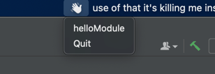

<h1 align="center">
  <br/>
  Create Go App tipBar
</h1>
<p align="center">
这是一个任务栏工具开发框架，它基于 <b>Golang</b> 开发。任务栏跨平台实现基于<a target="_blank" href="https://github.com/getlantern/systray">systray</a>
提示弹窗输入框等组件基于<a target="_blank" href="https://github.com/ncruces/zenity">zenity</a>，采用模块集成，快来开发属于你的任务栏工具吧。</p>

<p align="center">
<a href="https://github.com/danbai225/tipbar" target="_blank">
</a>&nbsp
<a href="https://pkg.go.dev/github.com/danbai225/tipbar?tab=doc" target="_blank">
</a>&nbsp;
<a href="https://gocover.io/github.com/danbai225/tipbar" target="_blank">
</a>&nbsp;<a href="https://goreportcard.com/report/github.com/danbai225/tipbar" target="_blank">

</a>&nbsp;</p>

## ⚡️ 快速开始
在你的项目中添加依赖
```bash
go get github.com/danbai225/tipbar
```
`main.go`

```Go
package main
import (
  logs "github.com/danbai225/go-logs"
  "github.com/danbai225/tipbar/core"
  "github.com/danbai225/tipbar/example/module/hello"
  "os"
)

func main() {
  var a *core.App
  var err error
  //指定配置文件参数 默认读取当前文件夹下config.json
  if len(os.Args) > 1 {
    a, err = core.NewApp(os.Args[1])
  } else {
    a, err = core.NewApp()
  }
  if err != nil {
    logs.Err(err)
    return
  }
  //注册模块
  a.RegisterModule(
    hello.ExportModule(),
  )
  err = a.Run()
  if err != nil {
    logs.Err(err)
    return
  }
}
```
`config.json`

```json
{
  "module": {
    "hello": {
      "enable": true,
      "config": null
    }
  },
  "http_port": 7989,
  "logs_dir": "./logs"
}
```

其中 `module.hello`是模块名，`enable`是`false`或不存在都不会启用这个模块

`logs`是日志输出目录 采用 `github.com/danbai225/go-logs` 作为日志输出

## 运行

- 根据上面快速开始构建一个项目
- 使用本项目demo运行，拉去项目后进入项目目录执行`cd example && go run main.go`

运行后日志会输出一些 `http` 路由,任务栏会出现一个图标点击会显示注册的模块。



# 开发文档

todo

介绍一些开发结

# 模块

- 将粘贴板中的代码转换成图片的模块 [code2img](https://github.com/danbai225/down_tip/tree/main/module/code2img)
- 天气和预警 [weather](https://github.com/danbai225/down_tip/tree/main/module/weather)
- 键盘按键次数统计 [keylog](https://github.com/danbai225/down_tip/tree/main/module/keylog)
